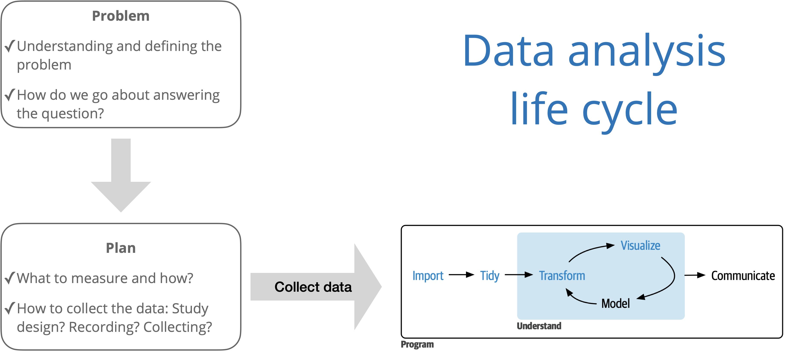

```{r}
#| include: false

library(tidyverse)
library(patchwork)
library(broom)
library(palmerpenguins)
library(ggformula)

knitr::opts_chunk$set(
  fig.width = 8,
  fig.asp = 0.618,
  fig.retina = 3,
  dpi = 300,
  out.width = "80%",
  fig.align = "center"
)

# set default theme and larger font size for ggplot2
ggplot2::theme_set(ggplot2::theme_bw(base_size = 16))
```

## Topics

-   Data analysis life cycle
-   Reproducible data analysis

##



Source: [*R for Data Science*](https://r4ds.hadley.nz/) with additions from *The Art of Statistics: How to Learn from Data*.

##


Source: [*R for Data Science*](https://r4ds.hadley.nz/)


# Reproducibility

## Reproducibility checklist

::: question
What does it mean for an analysis to be reproducible?
:::

. . .

**Near term goals**:

✔️ Can the tables and figures be exactly reproduced from the code and data?

✔️ Does the code actually do what you think it does?

✔️ In addition to what was done, is it clear *why* it was done?

. . .

**Long term goals**:

✔️ Can the code be used for other data?

✔️ Can you extend the code to do other things?

## Why is reproducibility important?

-   Results produced are more reliable and trustworthy [@ostblom2022]

-   Facilitates more effective collaboration [@ostblom2022]

-   Contributing to science, which builds and organizes knowledge in terms of testable hypotheses [@alexander2023]

-   Possible to identify and correct errors or biases in the analysis process [@alexander2023]

## When things go wrong {.smallest}

| Reproducibility error                                    | Consequence                                          | Source(s)                                                                                                       |
|-------------------|------------------|-----------------------------------|
| Limitations in Excel data formats                        | Loss of 16,000 COVID case records in the UK          | ([Kelion 2020](https://www.bbc.com/news/technology-54423988))                                                   |
| Automatic formatting in Excel                            | Important genes disregarded in scientific studies    | ([Ziemann, Eren, and El-Osta 2016](https://genomebiology.biomedcentral.com/articles/10.1186/s13059-016-1044-7)) |
| Deletion of a cell caused rows to shift                  | Mix-up of which patient group received the treatment | ([Wallensteen et al. 2018](https://pubmed.ncbi.nlm.nih.gov/27373757/))                                          |
| Using binary instead of explanatory labels               | Mix-up of the intervention with the control group    | ([Aboumatar and Wise 2019](https://jamanetwork.com/journals/jama/fullarticle/2752474))                          |
| Using the same notation for missing data and zero values | Paper retraction                                     | ([Whitehouse et al. 2021](https://www.nature.com/articles/s41586-021-03656-3))                                  |
| Incorrectly copying data in a spreadsheet                | Delay in the opening of a hospital                   | ([Picken 2020](https://www.bbc.com/news/uk-scotland-edinburgh-east-fife-53893101))                              |

Source: @ostblom2022

## Toolkit

-   **Scriptability** $\rightarrow$ R

-   **Literate programming** (code, narrative, output in one place) Jupyter-notebooks and Deepnote

-   **Version control** $\rightarrow$ Git / GitHub (Beyond the scope of this course)


## R and RStudio

-   R is a statistical programming language

-   Jupyter notebooks are a convenient interface for R

](images/01/r_vs_rstudio_1.png){fig-align="center"}

------------------------------------------------------------------------

## Deepnote

Let's all create a Deepnote account using our CofI email addresses.

------------------------------------------------------------------------

## Deepnote

-   Fully reproducible reports -- the analysis is run from the beginning each time you Run the full notebook

-   Code blocks for writing code and markdown blocks for writing prose

-   Visual editor to make document editing experience similar to a word processor (Google docs, Word, Pages, etc.)

## How will we use Deepnote?

-   Every application exercise and assignment is written in a Jupyter notebook

-   You'll have a template notebook to start with

-   The amount of scaffolding in the template will decrease over the semester

# Our first AE!

## Group Work Roles {.smaller}

Any time we are working on AEs, I will randomly assign you to groups of two or three. Each person will have a role:

- **Coder:** 
    +   Shares screen and is the only person to type.
    +   Runs code, saves work, and makes the submission.
    +   Reads comments back when asked and asks for clarification when unsure.
- **Developer:**  
    +   Directs the next steps: explains intent, outlines logic, and points out likely errors.
    +   Watches output, reads error messages aloud, and suggests targeted fixes.
- **Communicator:** 
    +   Looks up help when needed.
    +   Reports group answers to the class.

# Getting Started

::: appex
📋 [AE 01 - Getting Started](https://deepnote.com/workspace/CofI-MATH-269748c4-4966-4cc3-b064-2a31b9db85a4/project/AE-01-Getting-Started-f838426f-b7b7-45f4-87a9-5b7c929aa823/notebook/ae-01-getting-started-626fe75c7a02400584058fd9dc0e23ad?utm_source=share-modal&utm_medium=product-shared-content&utm_campaign=notebook&utm_content=f838426f-b7b7-45f4-87a9-5b7c929aa823)
:::

Complete the activity.


## Recap {.midi}

- The data analysis life cycle involves collecting, cleaning, exploring, modeling, and communicating data.
- Reproducibility ensures that results can be trusted and analyses can be repeated or extended.
- Common errors in data handling can have serious consequences—using reproducible tools helps avoid these problems.
- R is the language we use for analysis; RStudio is the IDE; Quarto is for creating reproducible documents.
- Group work in class uses defined roles to help everyone participate and learn.

## For Monday

- Complete and submit AE 01
- Complete readings

## References


